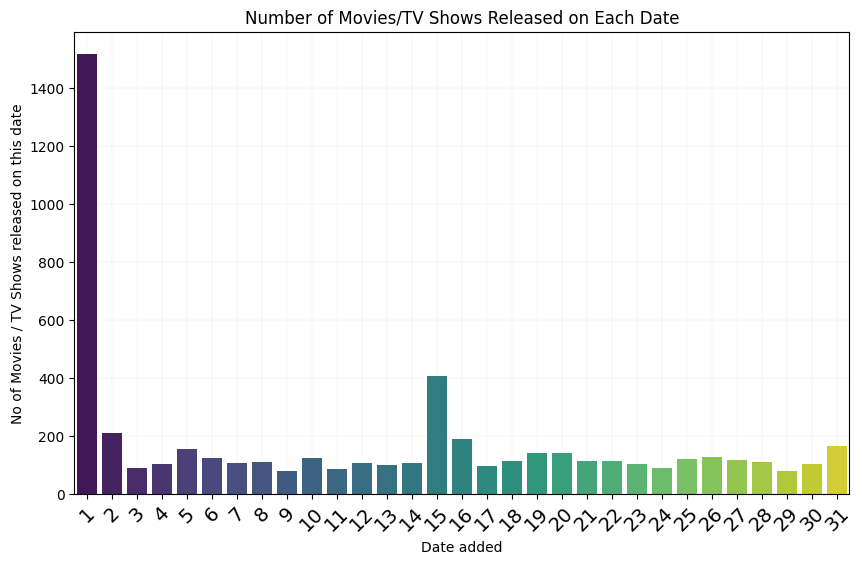
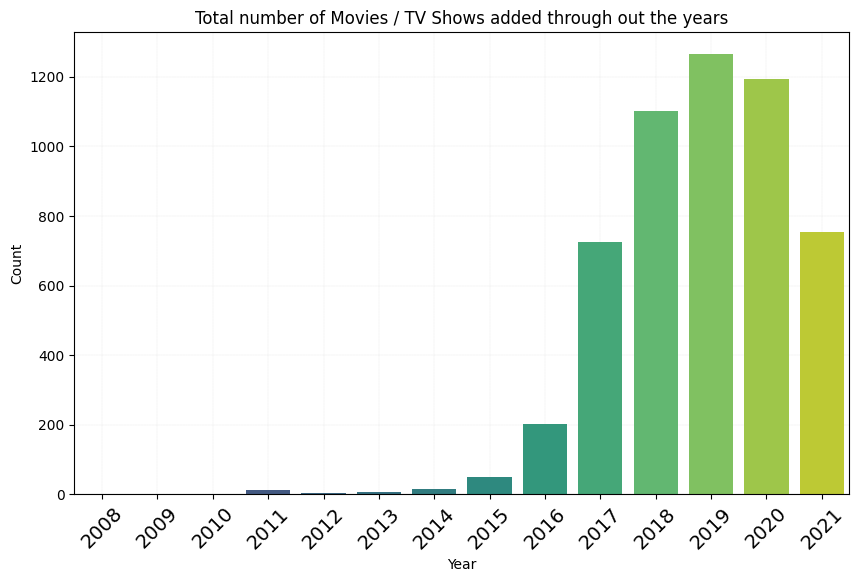
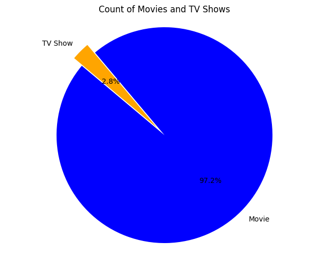
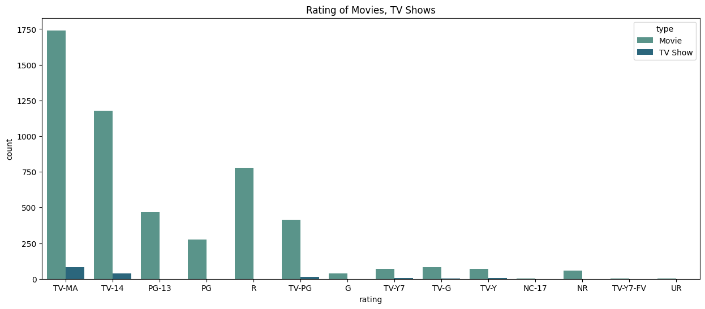
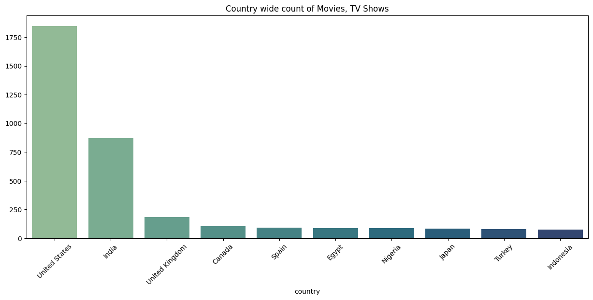
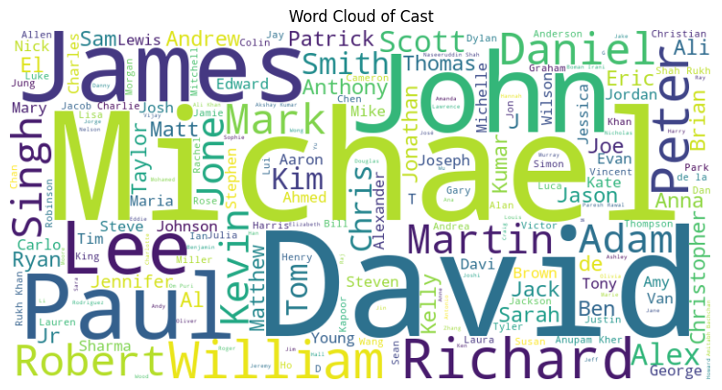

# Netflix Movies and TV Shows Data Analysis

## Project Overview
This project aims to analyze a dataset containing information about Netflix movies and TV shows. The dataset includes various details such as the title, director, cast, country, date added, release year, rating, and duration of each movie or TV show.

## Initial Impressions of the Data
The dataset contains 8807 rows and 12 columns. Out of these 12 columns, one is of `int64` data type and the rest are of `object` type. Upon examining the first 10 rows of the data, it is evident that there are some missing values.

## Data Details
The dataset has missing values in several columns:
- `director`: 2634 missing values
- `cast`: 825 missing values
- `country`: 831 missing values
- `date_added`: 10 missing values
- `rating`: 4 missing values
- `duration`: 3 missing values

## Summary of Release Year
The dataset contains information on movies released between the years 1925 and 2021. Here is a summary of the `release_year` column:
- **Count:** The dataset includes 8807 movies.
- **Mean:** The average release year of the movies is approximately 2014.
- **Standard Deviation:** The standard deviation is 8.82, indicating the variability in the release years of the movies.
- **Minimum:** The earliest movie in the dataset was released in 1925.
- **25th Percentile (Q1):** 25% of the movies were released before 2013.
- **Median (Q2):** 50% of the movies were released before 2017.
- **75th Percentile (Q3):** 75% of the movies were released before 2019.
- **Maximum:** The most recent movie in the dataset was released in 2021.

From this summary, we can observe that the majority of the movies in the dataset are relatively recent, with 50% of them released in or after 2017. A significant portion of the dataset consists of movies released in the last decade, with 75% being released in or after 2013 and 25% being released in or after 2019.

## Data Cleaning
To ensure accurate analysis, all missing values were removed from the dataset.

```python
import pandas as pd
import numpy as np
import matplotlib.pyplot as plt
import seaborn as sns

df = pd.read_csv('/Users/saibalajikondapalli/Documents/Python Practice/Netflix-Movies-and-TV-Shows-Data-Analysis/netflix_titles.csv')
df.head(10)
```

```python
df = df.dropna()

df['date_added'] = df['date_added'].str.strip()
df['date_added'] = pd.to_datetime(df['date_added'], format='%B %d, %Y')

df['day_added'] = df['date_added'].dt.day
df['month_added'] = df['date_added'].dt.strftime('%B')
df['year_added'] = df['date_added'].dt.year
df.drop(columns=['date_added'], inplace=True)
df.insert(6, 'day_added', df.pop('day_added'))
df.insert(7, 'month_added', df.pop('month_added'))
df.insert(8, 'year_added', df.pop('year_added'))
df.head()
```

## Data Analysis and Visualization

### Number of Movies/TV Shows Released on Each Date

```python
day_counts = df.groupby('day_added').size().reset_index(name='count')
day_counts = day_counts.sort_values('day_added')

plt.figure(figsize=(10,6))
sns.barplot(x='day_added', y='count', data=day_counts, palette='viridis')
plt.grid(visible=True, which='both', linestyle='--', linewidth=0.1)
plt.gca().set_axisbelow(True) 
plt.gca().yaxis.grid(True)    
plt.gca().xaxis.grid(True)
plt.ylim(0, None) 
plt.title('Number of Movies/TV Shows Released on Each Date')
plt.xlabel('Date added')
plt.ylabel('No of Movies / TV Shows released on this date')
plt.xticks(rotation=45, fontsize=14)
plt.show()
```



### Total Number of Movies/TV Shows Released Each Month

```python
month_added = df.groupby('month_added').size().reset_index(name='count')
month_order = ['January', 'February', 'March', 'April', 'May', 'June', 'July', 'August', 'September', 'October', 'November', 'December']
month_added['month_added'] = pd.Categorical(month_added['month_added'], categories=month_order, ordered=True)
month_added = month_added.sort_values('month_added')
month_added
```

```python
plt.figure(figsize=(10,6))
sns.barplot(x='month_added', y='count', data=month_added, palette='viridis')
plt.grid(visible=True, which='both', linestyle='--', linewidth=0.1)
plt.gca().set_axisbelow(True) 
plt.gca().yaxis.grid(True)    
plt.gca().xaxis.grid(True)
plt.ylim(0, None) 
plt.title('Total number of Movies / TV Shows released on each month')
plt.xlabel('Month')
plt.ylabel('Count')
plt.xticks(rotation=45, fontsize=14)
plt.show()
```


### Total Number of Movies/TV Shows Released Each Year

```python
year_added = df.groupby('year_added').size().reset_index(name='count')
year_added = year_added.sort_values('year_added')
year_added
```

```python
plt.figure(figsize=(10,6))
sns.barplot(x='year_added', y='count', data=year_added, palette='viridis')
plt.grid(visible=True, which='both', linestyle='--', linewidth=0.1)
plt.gca().set_axisbelow(True) 
plt.gca().yaxis.grid(True)    
plt.gca().xaxis.grid(True)
plt.ylim(0, None)  
plt.title('Total number of Movies / TV Shows added through out the years')
plt.xlabel('Year')
plt.ylabel('Count')
plt.xticks(rotation=45, fontsize=14)
plt.show()
```



This shows the trend of adaptation of the internet for movies.

### Distribution of Movies and TV Shows

```python
types = df['type'].value_counts()

explode = [0.1 if i == 0 else 0 for i in range(len(types))]

plt.figure(figsize=(8,6))
plt.pie(types, labels=types.index, autopct='%1.1f%%', colors=['blue','orange'], startangle=140, explode=explode)
plt.title('Count of Movies and TV Shows')
plt.axis('equal')
plt.show()
```



### Ratings of Movies and TV Shows

```python
plt.figure(figsize=(15,6))
sns.countplot(x='rating', hue='type', data=df, palette='crest')
plt.title('Rating of Movies, TV Shows')
plt.show()
```



### Country-Wide Count of Movies and TV Shows

```python
countries = df['country'].value_counts().head(10)
countries

plt.figure(figsize=(15,6))
sns.barplot(x=countries.index, y=countries.values, palette='crest')
plt.title('Country wide count of Movies, TV Shows')
plt.xticks(rotation=45)
plt.show()
```



### Word Cloud for Directors

```python
from wordcloud import WordCloud

text = " ".join(director for director in df['director'])

wordcloud = WordCloud(width=800, height=400, background_color='white').generate(text)

plt.figure(figsize=(10,5))
plt.imshow(wordcloud, interpolation='bilinear')
plt.axis('off')
plt.title('Word Cloud for Directors', fontsize=16)
plt.show()
```


### Word Cloud of Cast

```python
text_2 = ' '.join(cast for cast in df['cast'])

wordcloud_2 = WordCloud(width=800, height=400, background_color='white').generate(text_2)

plt.figure(figsize=(10,5))
plt.imshow(wordcloud_2, interpolation='bilinear')
plt.axis('off')
plt.title('Word Cloud of Cast')
plt.show()
```



## Next Steps
The next version of the analysis will involve removing null values based on the columns rather than on the entire dataset. This approach will help in preserving more data and providing a more accurate analysis.

## Repository Contents
- `Netflix.ipynb`: The Jupyter Notebook containing the initial data analysis.
- `README.md`: This file, providing an overview of the project.

## Acknowledgements
This project utilizes data from Kaggle, which provides a comprehensive view of the movies and TV shows available on their platform.

```
